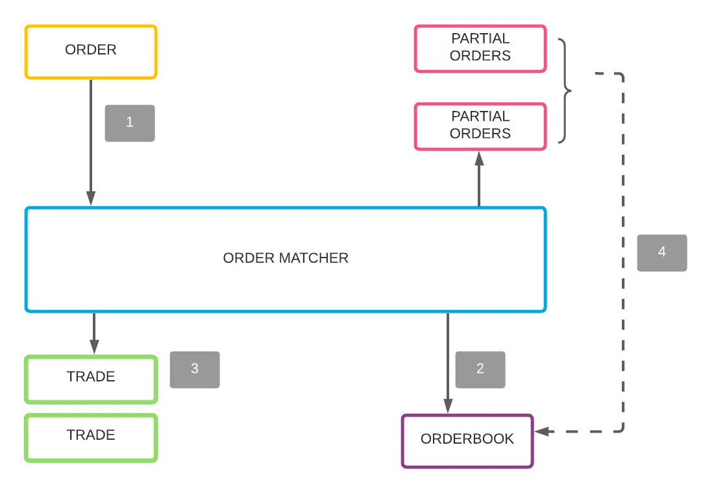
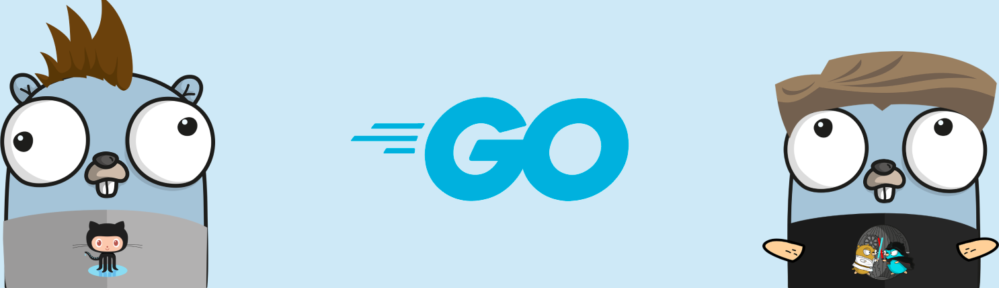

# Qoinify


Qoinify is a unique cryptocurrency exchange platform designed specifically for educational purposes.

The main goal is to trade ERC20 tokens from our Ganache sandboxes environment.

## Installation

1. clone this repository

```shell
$ git clone https://github.com/DavidRomanovizc/Qoinify.git
```

2. Run the main.go

## Matching Engine

Order Matcher is a program that uses an order book to match the buy order (bid) with the sell orders(ask) one or more
when the units are matched or match sell order with one or more buy orders to make trades.



## Release History

- 0.1.2
  - Changed the float64 data type to Decimal in the matching engine. 
  - Started working on the API

- 0.1.1
    - Distributed the code into different Go-style files and continued working on matching engine

- 0.1.0
    - Start working on matching engine
    - Add GitHub workflow for build go project

- 0.0.1
    - Begin a project

## Contributing

1. Fork this repository
2. Create you feature branch
3. Commit your changes
4. Push to the branch
5. Create a new Pull Request

<br>


